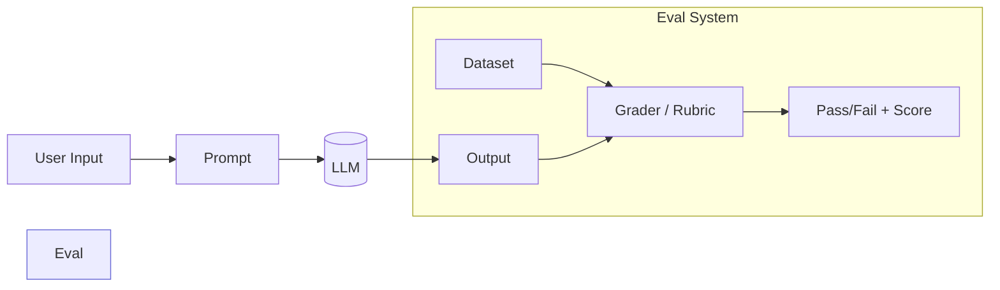
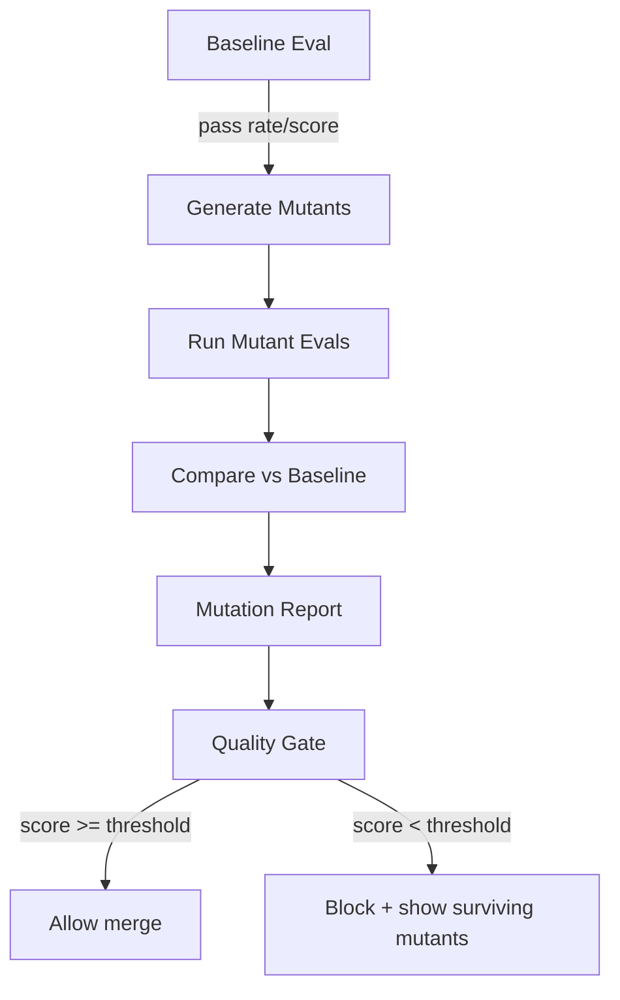
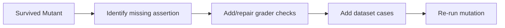

LLM 应用上线后最容易踩的坑，不是“效果不够好”，而是：**你以为被测试覆盖的行为，实际上根本没被你的 eval 约束住**。

传统软件测试里有个很硬的手段叫 **Mutation Testing（变异测试）**：
- 不是只看测试有没有跑过
- 而是**故意往代码里注入小错误（mutants）**，看测试能不能把它抓出来
- 抓不出来，就说明测试有盲区

这篇文章把它迁移到 LLM QA：对 *prompt / rubric / graders / evaluation data* 做“可控变异”，然后用一个简单指标 **Mutation Score** 来衡量你的 eval 是否真的“咬得住”。

面向：QA / 平台工程（有 CI、有质量门禁、希望把 LLM 输出变成可审计/可回滚的工程能力）。

---

## 1. 为什么 LLM 的 eval 很容易“假绿”

典型症状：

- Prompt 改了 3 行，线上行为大变，但 eval 仍然全绿
- 评审说“这个回答不对劲”，但你复现不了，因为 eval 样本覆盖不到
- 你有一堆规则，但 grader 太宽松/太依赖单一关键词

这本质上是：**eval 只在一个静态数据集上做断言**，它无法告诉你“断言有没有力量”。

> 变异测试回答的是：*你的测试/断言，是否能抵抗常见的错误形态？*

---

## 2. 概念迁移：从“变异代码”到“变异评测系统”

在 LLM 场景里，我们不一定改模型（成本高、不可控），更实用的是改这三类东西：

- **Prompt 变异（Prompt Mutants）**：故意删除/改写关键约束
- **Grader 变异（Grader Mutants）**：故意放松/偏置判分逻辑，模拟错误评测器
- **Data 变异（Data Mutants）**：对输入样本做轻微扰动，模拟真实世界噪声

### 2.1 一张“系统图”：你要测的到底是什么



**Mutation testing** 的目标不是让模型更强，而是让 *Eval System* 更可靠：
- 让“绿灯”更可信
- 让“红灯”更可解释

---

## 3. 定义指标：Mutation Score（针对 eval 的可操作版本）

先定义：

- 一个 **mutant**：对 prompt/grader/data 做一次最小变更
- mutant 被 **kill**：在同一组 eval 上，这个 mutant 导致结果变差（触发 fail 或显著降分）
- mutant **survive**：结果不变/仍通过（说明你的 eval 没抓住这个盲区）

一个朴素但够用的指标：

\[\text{MutationScore} = \frac{\#killed}{\#(total - invalid)}\]

其中 invalid 是“无意义变异”（比如把 prompt 全删了，等价于系统不能用）。

### 3.1 实战建议：先分层，不要一上来追求“高分”

- Prompt mutants：反映“约束是否写对/可被验证”
- Grader mutants：反映“判分是否稳健/是否能防作弊”
- Data mutants：反映“泛化与鲁棒性（噪声、格式漂移）”

---

## 4. 变异目录（Mutant Catalog）：给 QA 一份可复用清单

下面给一套**够工程化**、也足够轻量的变异清单。你可以只挑 10~20 个开始跑。

### 4.1 Prompt 变异（最常见）

1) **删除关键硬约束**
- 删除“只输出 JSON”
- 删除“不得编造/如不确定请说不知道”

2) **弱化语气（SHALL → SHOULD）**
- “必须包含字段”→“尽量包含字段”

3) **冲突指令注入**
- 在 system/developer 之后追加一条反向指令

4) **少样例 / 错样例**
- few-shot 少一个边界样例
- 故意加入一个错误示例，看 grader 能否抓出来

### 4.2 Grader 变异（很多团队的盲点）

1) **关键词作弊**
- 只要出现某词就判对（模拟“脆弱断言”）

2) **阈值漂移**
- 例如评分 >= 0.8 才 pass，变异为 >=0.6

3) **忽略格式约束**
- 明明要求 JSON，但 grader 不检查 schema

### 4.3 Data 变异（模拟真实世界输入噪声）

1) **单位/格式扰动**
- “1,000” vs “1000”
- “¥100” vs “100 JPY”

2) **字段缺失**
- 真实请求经常缺字段：让系统必须能解释缺失

3) **语言混杂**
- 中英混合、表情符号、换行/列表

---

## 5. 一个可落地的最小实现：在 CI 里跑“Eval Mutation”

这里给一个最小可用的结构（你可以替换成自己的 eval 框架：OpenAI Evals、内部服务、或任何自建脚本）。

### 5.1 目录结构（建议）

```text
llm-eval/
  eval/               # 你的基线评测
    dataset.jsonl
    prompt.txt
    grader.py
  mutants/
    prompt/           # 变异规则
    grader/
    data/
  run_eval.py
  run_mutation.py
```

### 5.2 用 Mermaid 画“流水线”：baseline → mutants → 报告



### 5.3 示例代码：生成几个 prompt mutants（超简版）

```python
# run_mutation.py (demo)
import copy
from dataclasses import dataclass

@dataclass
class Mutant:
  name: str
  prompt: str

def mutate_remove_json_constraint(prompt: str) -> str:
  return prompt.replace("You must output valid JSON.", "")

def mutate_weaken_must_to_should(prompt: str) -> str:
  return prompt.replace("MUST", "SHOULD")

def generate_prompt_mutants(base_prompt: str):
  muts = []
  muts.append(Mutant("remove-json-constraint", mutate_remove_json_constraint(base_prompt)))
  muts.append(Mutant("must-to-should", mutate_weaken_must_to_should(base_prompt)))
  return muts

# 你需要实现：run_eval(prompt, dataset) -> metrics
# metrics 至少要包含 pass_rate 或 aggregate_score
```

### 5.4 如何判定“kill”：用一个稳健的差异条件

不要只用“是否全绿”，建议至少用以下之一：

- **Fail gate**：mutant 通过率从 99% 掉到 < 95% → kill
- **Score drop**：平均分下降超过 δ（比如 0.05）→ kill
- **关键样本红线**：某些高风险样本必须通过（如安全/合规/金钱）→ kill

用表格表达（便于你写报告）：

```text
Mutant Name             | Baseline Pass | Mutant Pass | Delta | Status
------------------------|---------------|-------------|-------|--------
remove-json-constraint  | 0.99          | 0.62        | -0.37 | KILLED
must-to-should          | 0.99          | 0.97        | -0.02 | SURVIVED  (warning)
```

**Survived 的 mutant** 就是你下一轮要补 eval 的方向：
- 如果删掉 JSON 约束也没红：说明你根本没测格式
- MUST→SHOULD 不红：说明你的 grader 只测语义，不测硬约束

---

## 6. 把“Survived mutants”变成可执行的补洞任务

建议把输出报告直接转成 issue/任务：



工程化落地的关键：**让它进入循环**，而不是写一篇“如何做 eval”的文档。

---

## 7. 常见坑（我建议你提前规避）

1) **mutants 太多 → 成本爆炸**
- 做“采样”：每天跑 20 个，周末全量

2) **把模型随机性当成“杀死/存活”**
- 固定 seed / temperature
- 至少跑 N 次取均值，或者用置信区间

3) **invalid mutants 混进指标**
- 建议为 mutant 打标签：valid/invalid
- invalid 不计入分母

4) **只看分数，不看案例**
- Mutation report 必须能点开看到“哪些样本失败”

---

## 8. 小结：为什么它对 QA/平台工程值得

- 它把“prompt 改动风险”变成了**可量化的门禁指标**
- 它强迫你把“软规则”变成**可验证的断言**
- 它天然产出一份**盲区清单（survived mutants）**，帮助你补数据、补 grader

如果你已经在做 LLM-as-Judge / Evals，把变异测试加进去，会明显降低“假绿”带来的线上返工。

---

## 参考资料

- Mutation testing 概念与生态（PIT, Java）：https://pitest.org/
- OpenAI 官方：Working with evals（如何组织 eval / grader / 数据集）：https://platform.openai.com/docs/guides/evals
- arXiv: GPT-4 Technical Report（关于评测、可靠性与能力边界的公开报告）：https://arxiv.org/abs/2303.08774
- GitHub Actions workflow commands（CI 里产出注释/摘要/门禁信息的常用方式）：https://docs.github.com/en/actions/reference/workflows-and-actions/workflow-commands
