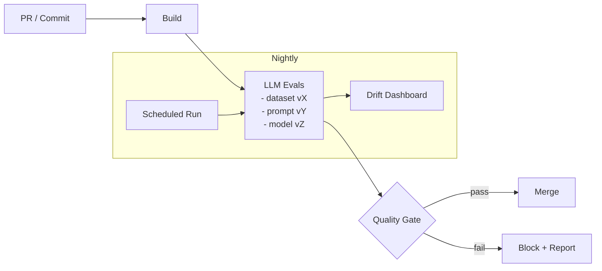
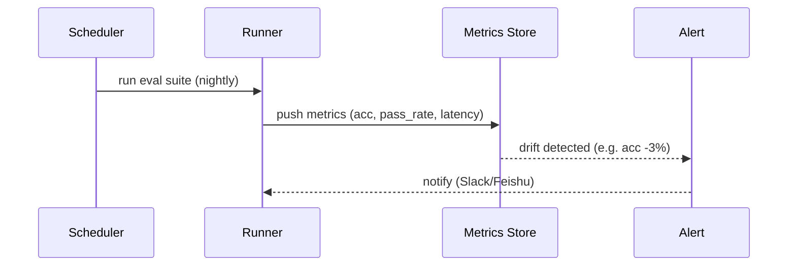

很多团队把 LLM 集成当成“不可测”的黑盒：线上出了问题靠回滚 prompt，或者临时加几条样例再试试。真正可持续的做法是：**把 LLM 功能当成产品能力**，用一套可重复的评估（evals）在 CI 中做回归、做门禁、做漂移监控。

这篇文章给 QA / 平台工程一个 **可落地的最小闭环**：

- 评估集（dataset）：版本化、可审计
- 评估器（grader）：规则 / 参考答案 /（可选）模型打分
- CI 门禁：失败就不让合并
- 漂移监控：每日跑一遍，指标变化就告警

图文并茂部分我会用 **Mermaid + ASCII** 画图（原创）。

---

## 1. 最小闭环：从“测一次”到“持续测”

### 1.1 Pipeline 心智模型（原创示意图）



### 1.2 为什么“evals”比“几条手工样例”强

- **可重复**：同一套输入、同一套标准，任何人/任何时间都能复现。
- **可比较**：prompt 版本、模型版本、检索索引版本，变化都可量化。
- **可门禁**：质量指标达不到就禁止合并（像单测、lint 一样）。

官方也强调 evals 对可靠性的重要性：OpenAI 的文档将 evals 视为构建可靠 LLM 应用的关键环节，特别是在升级模型或迭代 prompt 时（见参考链接）。

---

## 2. 设计你的评估集：让数据“可维护”

### 2.1 Dataset 的三类样本（建议比例）

1) **Gold（50%）**：有明确“参考答案”的样本
- 适合分类、结构化抽取、格式化输出（JSON）、SQL 生成等

2) **Policy（30%）**：安全/合规/风格约束
- 例如：不得泄露隐私、不得输出公司机密字段、必须带引用链接

3) **Edge（20%）**：极端/对抗样本
- 例如：提示注入、超长输入、模糊指令、混合语言

### 2.2 版本化结构（推荐）

```
llm-evals/
  datasets/
    support_ticket_classification.v1.jsonl
    support_ticket_classification.v2.jsonl
  prompts/
    classify_ticket.v3.txt
  graders/
    json_schema_check.py
    string_check.py
```

核心原则：**评估集不是一次性 artefact，而是长期维护的产品资产**。

---

## 3. 评分策略：从“硬规则”开始，再逐步引入模型打分

下面按 QA 最常用、最容易落地的顺序来。

### 3.1 Level 1：硬规则（格式/Schema/关键词）

适用：任何必须满足“输出契约”的场景，比如 API 返回 JSON。

**ASCII 原创示意图：输出契约门禁**

```
          +--------------------+
Prompt -->| LLM Output (text)  |--> parse --> JSON --> schema validate --> PASS/FAIL
          +--------------------+
                     |
                     +--> if parse fails => FAIL (actionable)
```

你可以在 CI 里直接用 JSON Schema 校验（失败即阻断），这类失败往往最“可修复”（加约束、加示例、加工具调用）。

### 3.2 Level 2：参考答案（Exact/Normalized Match）

适用：分类、枚举值、固定字段抽取。

- exact match：最简单
- normalized match：去空格/大小写/同义词映射

### 3.3 Level 3：模型打分（Model-graded）

适用：摘要质量、客服语气、解释是否清晰等难以写硬规则的维度。

注意：模型打分也需要**基准与约束**（例如对齐 rubric），并且要防“自嗨”。实践上常见策略：

- 先用硬规则兜底（格式/安全）
- 再用模型打分评价“好坏”

OpenAI 的开源 Evals 项目提供了评估框架与大量范例（见参考）。

---

## 4. 在 CI 里跑：pytest + 一份 JSONL + 一个 Quality Gate

下面给一个“最小可用”的示例：用 pytest 执行 eval，用阈值做门禁。

### 4.1 评估集：JSONL（示例）

> 文件：`llm-evals/datasets/ticket_classify.v1.jsonl`

```json
{"id":"t1","input":"My monitor won't turn on.","expected":"Hardware"}
{"id":"t2","input":"I can't quit vim.","expected":"Software"}
{"id":"t3","input":"Best restaurants in Cleveland?","expected":"Other"}
```

### 4.2 pytest：最小 eval runner（示例）

```python
# tests/test_llm_eval_ticket_classify.py
import json
from pathlib import Path

import pytest

DATASET = Path("llm-evals/datasets/ticket_classify.v1.jsonl")

# 你可以把真实调用封装成适配器：OpenAI / Azure / 你们的网关 / 本地 stub

def call_model(text: str) -> str:
    # 这里用伪代码示意：
    # resp = client.responses.create(model=..., input=[...])
    # return resp.output_text.strip()
    raise NotImplementedError


def load_items():
    items = []
    for line in DATASET.read_text(encoding="utf-8").splitlines():
        items.append(json.loads(line))
    return items


def normalize(label: str) -> str:
    return label.strip().lower()


def test_quality_gate_ticket_classify():
    items = load_items()
    correct = 0

    for it in items:
        out = call_model(it["input"])
        if normalize(out) == normalize(it["expected"]):
            correct += 1

    acc = correct / len(items)

    # 质量门禁：可按 PR 更严、nightly 更宽
    assert acc >= 0.90, f"accuracy={acc:.3f} < 0.90"
```

pytest 的断言与用例组织非常适合作为 eval runner 的壳（pytest 官方文档也强调其可扩展与插件生态，见参考）。

### 4.3 CI 门禁：两条建议

- PR：**阈值更严** + 样本更少（快）
- Nightly：**覆盖更广** + 允许波动，但监控趋势

---

## 5. 漂移监控：每天跑一次，比“事故复盘”便宜得多

把 nightly 的 eval 结果写进时序（Prometheus/ClickHouse/BigQuery 都行），你至少要记录：

- eval 名称、dataset 版本、prompt 版本、model 版本
- 指标：accuracy / format pass rate / refusal rate / latency / cost

**Mermaid 原创示意图：漂移监控闭环**



漂移阈值的经验值（仅作起步）：

- accuracy 下降 ≥ 2~3% 且持续 2 次：告警
- format pass rate 下降 ≥ 1%：高优先级（通常代表输出契约变差）

---

## 6. 让结果更“可行动”：报告里必须包含“可复现证据”

很多 eval 失败不可修复，原因是报告只给一个分数。建议在失败时输出：

- 失败样本 id
- 输入
- 模型输出（截断）
- 哪个 grader 失败
- 关联版本（dataset/prompt/model）

这样你在 PR 评论区就能做到：**指哪改哪**。

---

## 7. 常见坑（QA/平台视角）

1) **只测 happy path**：上线后 prompt injection 一次就把你打穿
2) **评估集不版本化**：结果不可对比，回归也无意义
3) **用模型打分替代硬规则**：先把格式/安全门禁做好
4) **不记录模型/提示/检索版本**：你永远不知道指标变化是谁造成的
5) **只在 PR 跑、不做 nightly**：漂移通常不是一次提交引起的

---

## 参考资料（References）

- OpenAI API 文档：Working with evals（配置与运行 eval 的流程、数据与 grader 概念）
  - https://platform.openai.com/docs/guides/evals

- OpenAI 开源项目：openai/evals（评估框架与 registry 思路）
  - https://github.com/openai/evals

- pytest 官方文档（测试组织、断言与扩展生态，适合作为 eval runner 外壳）
  - https://docs.pytest.org/en/stable/

- Casper et al., 2024：Black-Box Access is Insufficient for Rigorous AI Audits（讨论黑盒评估的局限与更强评估方式的价值）
  - https://arxiv.org/abs/2401.14446
