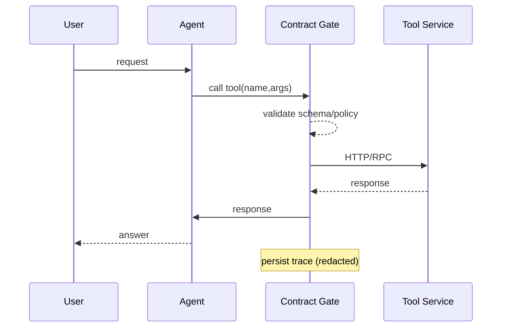

当你把 LLM 接到一堆工具（HTTP API、DB、队列、内部脚本），再加上 Agent 的“计划-执行-反思”循环后，测试会立刻变得不稳定：

- 同一个 prompt，多跑几次就出现不同工具序列
- 工具输入参数一会儿带多余字段、一会儿缺字段
- 生产里偶发 400/500，回放却复现不了

这篇文章给一个很实用的答案：**把“工具调用”当作接口，把 Agent 当作消费者，用“契约测试（contract testing）”把它测稳。**

核心目标不是“测模型会不会说话”，而是：

1) 工具调用是否满足协议（schema/约束/安全规则）
2) 工具端是否向后兼容（不把消费者炸掉）
3) 在 CI 里能稳定跑、可回放、可定位

---

## 1. 什么是“Agent 工具调用的契约”？

把一次工具调用抽象成：

- **工具名**：例如 `searchTickets`
- **输入**：JSON（参数 + 约束）
- **输出**：JSON（字段 + 约束 + 错误形态）
- **行为约束**：幂等性、分页、速率限制、权限边界、PII 规则

如果你已经在用 MCP（Model Context Protocol），那你天然就有一个契约入口：**工具定义（tools）+ 输入 schema + 返回值结构**。

> 关键思想：
> - **消费者（Agent）**：需要工具的“能力”保持稳定。
> - **提供者（Tool 服务）**：可以演进，但必须保证不破坏既有消费者。

---

## 2. 测试设计：三层契约测试矩阵

下面这张矩阵你可以直接照搬到 CI：

```mermaid
flowchart TB
  A[Agent/Prompt
(Consumer)] -->|calls| B[Tool Contract Layer
(schema + policies)]
  B --> C[Provider Stub/Mock
(consumer contract tests)]
  B --> D[Real Provider
(provider verification)]

  subgraph CI
    A
    B
    C
  end

  subgraph Pre-Prod / Nightly
    D
  end
```

### 2.1 Consumer Contract Tests（Agent 侧）

目标：保证 Agent 产生的工具调用 **永远合法**。

你需要测的是：

- 工具名必须在 allowlist
- 参数必须满足 JSON Schema（类型/必填/枚举/范围）
- 安全策略：不允许把 secrets/PII 带进外部工具
- 业务规则：例如 `limit <= 100`、`startTime <= endTime`

在这层，**不需要真实工具服务**：用 stub 让 Agent 走完调用链，并捕获“它打算怎么调用工具”。

### 2.2 Provider Verification（工具侧）

目标：工具服务更新后，仍然满足契约（尤其是：返回结构、错误码、兼容性）。

这里建议：

- provider 在 CI 里跑一套“契约验证”，对照契约文件（schema/示例）
- provider 的集成测试可以在 pre-prod/nightly 跑（避免 flaky）

### 2.3 Replay/Canary（回放/金丝雀）

目标：把线上真实工具调用（脱敏后）回放到新版本，捕获破坏性变更。

---

## 3. 最关键的工件：一份“可执行契约（Executable Contract）”

建议把契约存成一个仓库内的文件（或单独 repo），结构类似：

```yaml
# contracts/searchTickets.v1.yaml
name: searchTickets
version: 1
inputSchema:
  type: object
  additionalProperties: false
  required: [query, limit]
  properties:
    query: { type: string, minLength: 1 }
    limit: { type: integer, minimum: 1, maximum: 100 }
    status: { type: string, enum: [open, closed, all] }
policies:
  allowOutbound: true
  pii:
    forbidPatterns:
      - "\\b\\d{16}\\b" # naive card-like
outputSchema:
  type: object
  required: [items]
  properties:
    items:
      type: array
      items:
        type: object
        required: [id, title]
        properties:
          id: { type: string }
          title: { type: string }
errors:
  - code: "INVALID_ARGUMENT"
    httpStatus: 400
```

这份契约有三个“抗演进”建议：

1) **`additionalProperties: false`**：强制消费者不要乱带字段（能显著减少线上“模型脑补参数”）
2) 对输入做 **可解释的约束**（枚举/范围/必填），错误返回要结构化
3) 版本化：`searchTickets.v1` → `v2` 时兼容策略明确（见第 6 节）

---

## 4. 实操：用“契约门禁”把 Agent 输出拦下来

### 4.1 生成工具调用的“捕获点”

无论你用什么框架（自研/LangChain/自定义 Agent），都应该把工具调用集中到一个 wrapper：

```ts
// toolInvoker.ts
export async function invokeTool(toolName: string, args: unknown) {
  validateToolNameAllowlist(toolName)
  validateAgainstContract(toolName, args) // JSON Schema + policies
  return realToolCall(toolName, args)
}
```

### 4.2 最小可用的 JSON Schema 校验

Node 生态里 Ajv 很常见：

```ts
import Ajv from "ajv";

const ajv = new Ajv({ allErrors: true, strict: true });

export function validateAgainstContract(toolName: string, args: unknown) {
  const { inputSchema } = loadContract(toolName);
  const validate = ajv.compile(inputSchema);
  const ok = validate(args);
  if (!ok) {
    throw new Error(`CONTRACT_VIOLATION ${toolName}: ${ajv.errorsText(validate.errors)}`);
  }
}
```

配合 `additionalProperties: false`，你会立刻看到很多“模型多塞字段”的问题。

---

## 5. 把“不稳定”变成“可回放”：记录工具调用轨迹

给 QA/平台工程一个强烈建议：**记录每次 Agent run 的 tool trace（但要脱敏）**。



trace 最少包含：

- toolName
- redacted args（脱敏规则要可配置）
- response schema 验证结果（pass/fail）
- latency/重试次数
- 失败时的错误结构

**为什么这很重要？**

- 你可以把线上样本“变成测试用例”（回放）
- 可以把 flaky 的根因定位到“哪个工具调用不满足契约”

---

## 6. 工具契约的演进策略：兼容优先

对工具服务来说，最容易踩坑的是：

- 改字段名
- 改返回结构
- 把可选字段变必填

建议采用和 API 版本化一致的策略：

- **新增字段**：可以（但不要让消费者依赖它，先灰度）
- **删除字段/改类型/改语义**：只能通过 `v2`（新工具名或新版本号）
- **错误码结构化**：稳定且可枚举（利于 Agent 做恢复策略）

一个简单的版本策略：

```text
tool: searchTickets@v1  (frozen)
tool: searchTickets@v2  (new)
Agent 默认用 v1；灰度阶段给部分流量切 v2；回放验证通过后全量。
```

---

## 7. CI 落地：一条可复制的流水线

你可以在 GitHub Actions 做成 2 个 job：

- `agent-contract-tests`：跑 consumer tests（stub 工具），必须稳定、快
- `provider-contract-verify`：对工具服务跑 provider verification

如果你有多个 repo，建议用 **reusable workflows** 复用一致的测试逻辑（减少“每个 repo 一套不一样的门禁”）。

---

## 8. 常见坑与对策（平台工程视角）

- **坑 1：只做 schema，不做 policy**
  - 对策：把 allowlist、出网规则、PII 检测当作契约的一部分。

- **坑 2：契约写了但没人执行**
  - 对策：把 gate 放在唯一 tool invoker 入口，绕不过去。

- **坑 3：测试跑不稳（LLM 波动）**
  - 对策：
    1) consumer contract tests 只验证“工具调用是否合法”，不要验证最终自然语言答案；
    2) 用固定 seed/temperature（如果支持）；
    3) 记录 trace 回放。

- **坑 4：工具升级导致线上偶发失败**
  - 对策：provider verification + 回放 canary，先发现再上线。

---

## 参考资料

- arXiv: *Let’s Verify Step by Step*（过程监督 vs 结果监督，对“过程可验证”的价值有启发）
  - https://arxiv.org/abs/2305.20050
- OpenAI Evals（评测框架/基准注册思路，可借鉴“可执行评测/回放”工程化）
  - https://github.com/openai/evals
- GitHub Docs: Reuse workflows（多 repo/多项目复用 CI 流水线，适合平台工程推广契约门禁）
  - https://docs.github.com/en/actions/how-tos/reuse-automations/reuse-workflows

---

如果你已经在做 LLM-as-Judge、prompt 变异测试、SLO-driven load test：**契约测试是把“工具层”那块地基做扎实的下一步。**
