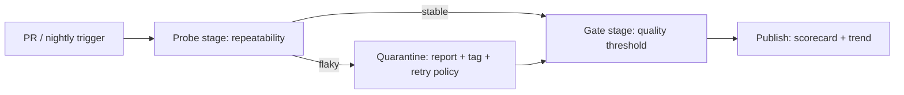

在做 LLM/Agent 的端到端测试时，很多团队都会遇到同一个“隐形杀手”：

- 代码没变，prompt 没变，环境也没变
- 但同一条用例：**有时过，有时挂**

这类非确定性（non-determinism）会把 CI 变成噪声放大器：工程师开始“看红不看红”，最终整套回归系统失去信任。

这篇文章给你一个可以落地的做法：**Flakiness Firewall（易波动性防火墙）**。

核心思路：

1) 在进入主流水线之前，对 LLM 用例做 **可重复性探测**（repeatability probe）
2) 对有波动的指标，使用 **稳健聚合**（robust aggregation），而不是“单次 pass/fail”
3) 对“可疑用例”自动降级隔离（quarantine），让健康用例继续给出强信号

文章偏向 QA / 平台工程，配套给出：阈值建议、CI 接入方式、以及可直接抄走的伪代码。

---

## 1. Flakiness Firewall：把“随机性”当成一等公民

Martin Fowler 在讨论测试非确定性时指出：非确定性测试一旦被忽略，就会“感染”整个测试套件，最后健康用例也没人信了。解决方式之一是**隔离（quarantine）**，并尽快修复。\
参考：<https://martinfowler.com/articles/nonDeterminism.html>

LLM 测试的非确定性来源更复杂：

- 采样随机性（temperature/top_p）
- 上下文长度边界导致的输出抖动
- 工具/外部系统返回值波动
- 模型升级、路由策略变化
- 并发、限流、重试导致的时序差异

所以我们需要一个机制：

- **不强迫所有用例都变成“完全确定”**（这在 LLM 场景不现实）
- 但要保证：进入主干质量门禁的信号，必须足够稳定

这就是 Flakiness Firewall。

---

## 2. 结构：两段式流水线（Probe → Gate）

用一张简单的 Mermaid 图说明：



- **Probe stage**：同一批样本，用不同 seed/不同并发切片跑多次，测“波动性”
- **Gate stage**：对稳定指标才做硬门禁；对波动指标用稳健统计后再判定
- **Quarantine**：把“可疑用例”从主门禁中抽离，但依然留下可追踪的工作项

Playwright 的 retries 机制也体现了类似理念：失败会启动新 worker 重跑，保证失败不会污染健康用例的执行环境。\
参考：<https://playwright.dev/docs/test-retries>

---

## 3. 用一个最小可用的“可重复性指标”定义 flakiness

先定义：你有一个 eval 任务，跑完得到一个分数 `s`（0~1），例如：

- 分类准确率
- rubric 打分的平均分
- LLM-as-judge 的胜率/偏好分

（OpenAI Evals 指南介绍了如何以“数据集 + grader”的方式做评测，这里我们不绑定具体平台实现。）\
参考：<https://platform.openai.com/docs/guides/evals>

现在我们对同一批 items，重复跑 `K` 次，得到：

```
s1, s2, ..., sK
```

我们关心两件事：

1) **中心位置**（期望质量）：例如 median
2) **波动程度**（可重复性）：例如 IQR / MAD / 标准差

这里推荐一个足够工程化、容易解释的组合：

- 中心：`median(s)`
- 波动：`IQR(s) = Q3 - Q1`

ASCII 示意图（箱线图直觉）：

```text
score
1.0 |                 ┌───────┐
    |                 │  Q3   │
0.8 |        ┌────────┘       └────────┐
    |        │        median            │
0.6 |        └────────┐       ┌────────┘
    |                 │  Q1   │
0.4 |                 └───────┘
    +------------------------------------
                repeated runs

IQR = Q3 - Q1  （越大越不稳定）
```

### 建议阈值（起步版）

- `K = 7`（一周 7 次的直觉，也够看波动）
- 认为“可接受稳定”的阈值：
  - `IQR <= 0.03`（分数尺度 0~1 时，3 个百分点的四分位距）

阈值别一次拍死：先用两周历史跑出分布，再把 `IQR` 的 P80 作为初始门槛，会更稳。

---

## 4. Gate：用“稳健聚合”代替“单次判定”

如果你用单次 `s >= 0.80` 做门禁，那么随机抖动就会直接变成 PR 噪声。

改成：

- 取 `median(s)` 做门禁
- 同时要求 `IQR(s)` 不超过阈值

判定逻辑：

```text
PASS if  median(s) >= T  AND  IQR(s) <= F
else FAIL (or QUARANTINE)
```

这比均值/标准差更抗异常值：

- 偶发一次“模型输出跑偏”不会立刻把 PR 拦死
- 但如果整体在变差，median 会很快反映

---

## 5. Quarantine：对“波动过大”的用例做隔离，而不是硬拦

当 `IQR(s) > F`：

- 不要直接把 PR 挂死（否则团队会开始绕过测试）
- 也不要假装没看见（否则会持续污染）

建议做法：

1) 把该 eval 标记为 `quarantined`
2) 在报告里给出：
   - median
   - IQR
   - 近 14 天趋势
   - 可能原因提示（温度、并发、外部依赖、速率限制等）
3) 只对“健康用例集合”做硬门禁

这对应 Fowler 的建议：把非确定性测试从主套件隔离，同时设置机制防止长期遗忘。\
参考：<https://martinfowler.com/articles/nonDeterminism.html>

---

## 6. 实现：CI 里的最小闭环（伪代码）

下面是一段“平台无关”的伪代码（你可以映射到任意 eval runner）：

```python
import random
from statistics import median

def quantile(xs, q):
    xs = sorted(xs)
    pos = (len(xs) - 1) * q
    lo = int(pos)
    hi = min(lo + 1, len(xs) - 1)
    frac = pos - lo
    return xs[lo] * (1 - frac) + xs[hi] * frac

def iqr(xs):
    return quantile(xs, 0.75) - quantile(xs, 0.25)

def run_eval(seed: int) -> float:
    # call your model / agent + graders
    # return a scalar score in [0, 1]
    ...

K = 7
T = 0.80   # quality threshold
F = 0.03   # flakiness threshold

scores = []
for k in range(K):
    seed = random.randint(1, 10**9)
    scores.append(run_eval(seed))

m = median(scores)
flk = iqr(scores)

if flk > F:
    status = "QUARANTINE"  # do not hard fail PR
elif m >= T:
    status = "PASS"
else:
    status = "FAIL"

print({"scores": scores, "median": m, "iqr": flk, "status": status})
```

### CI 集成小技巧

- 把 `scores/median/iqr/status` 输出成 JSON 工件，方便后续趋势分析
- 对 PR：只在 `FAIL` 时阻断；`QUARANTINE` 给 warning + 创建工单
- 对 nightly：同时跑 quarantined 集合，用于定位原因

GitHub Actions 的 workflow commands 支持在日志里生成 `::warning` / `::error` 注解，能把结果“贴”在 PR 上，减少来回翻日志。\
参考：<https://docs.github.com/en/actions/using-workflows/workflow-commands-for-github-actions>

---

## 7. 进阶：把“波动”拆解到可行动的维度

当你发现某个 eval flakiness 爆表时，建议按这个顺序排查（从容易到困难）：

1) **采样参数**：temperature/top_p 是否过高？能否固定 seed？
2) **输入漂移**：检索/工具输出是否会变？能否快照化？
3) **并发与限流**：同一时间窗口调用是否触发降级路径？
4) **评分器波动**：LLM-as-judge 是否也需要 repeatability probe？

一个常见有效的策略是：

- 被测模型：允许轻微随机（更贴近真实）
- judge：尽量确定（temperature=0）并做抽样复核

---

## 8. 小结（可直接抄走）

- 对 LLM 测试，**先测可重复性**，再做质量门禁
- 用 `median + IQR` 这样的稳健统计，替代单次判定
- 对波动用例走 quarantine：别让噪声摧毁 CI 信任

如果你已经在用 k6、Playwright、或 Evals 平台，把上面的 Probe/Gate 拆成两个 job，第一天就能开始收集“波动画像”。

---

## References

- Martin Fowler, *Eradicating Non-Determinism in Tests* (quarantine / non-determinism): <https://martinfowler.com/articles/nonDeterminism.html>
- OpenAI Docs, *Working with evals* (datasets + graders/evals API): <https://platform.openai.com/docs/guides/evals>
- Playwright Docs, *Retries* (retry model & flaky categorization): <https://playwright.dev/docs/test-retries>
- GitHub Docs, *Workflow commands for GitHub Actions* (log annotations like ::warning/::error): <https://docs.github.com/en/actions/using-workflows/workflow-commands-for-github-actions>
