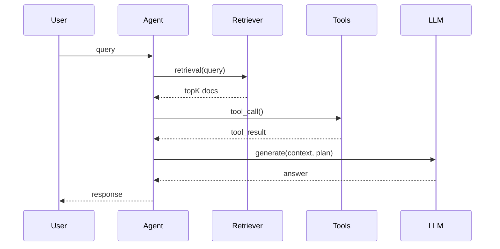

很多团队在把 AI Agent（带工具调用 / RAG / 多步骤计划）上线后，会遇到一个尴尬现实：

- 功能 demo 时很好看，但**线上偶发失败**很难复现
- Prompt/模型/检索配置改一点点，效果就飘（而且很难说清哪里变了）
- 传统 E2E 只看最终输出，**定位不了是哪一步坏了**

这篇文章给一个偏平台工程/QA 的实践方案：**把“执行 Trace（轨迹）”当成测试资产**，建立“基于 Trace 的回归测试”（trace-based regression tests）。核心目标是：

1) 回归测试不只验最终答案，还验 *Agent 的过程*（检索、工具、计划、关键中间产物）
2) 当回归失败时，能用 Trace 快速定位是哪一段退化
3) 成本可控：把“昂贵的 LLM Judge”放在该用的地方，其余用规则/阈值


## 什么是 Agent Trace（以及为什么它适合做回归）

把一次 agent run 拆开看，一般至少包含：

- 输入：用户 query + 上下文（会话、profile、权限…）
- 检索：query → topK 文档（含得分、chunk、来源）
- 计划：步骤/工具调用意图
- 工具调用：HTTP/DB/搜索/内部 API，及其 latency / error
- 生成：中间草稿、最终 answer
- 产出：答案 + 引用 + 结构化结果（JSON）

把这些事件按时间顺序记录下来，就是 Trace。好消息是：**你不需要自造格式**。
OpenTelemetry（OTel）本来就是用来记录 traces/metrics/logs 的开源标准框架，适合做跨语言、跨组件的链路记录与导出。

> OTel 的定位：vendor-neutral 的观测框架，可采集并导出 traces/metrics/logs。


## 方案总览：Trace → “可断言”信号 → CI Gate

下面是一个可落地的最小闭环：

```mermaid
flowchart LR
  A[Agent Run] -->|OTel spans| B[Trace Store
(OTLP Collector)]
  B --> C[Trace Extractor
(JSON)]
  C --> D[Assertions
(rules + thresholds)]
  C --> E[Optional LLM Judge
(spot checks)]
  D --> F[CI Report
+ diff]
  E --> F
```

你会得到两类回归信号：

- **结构化断言（cheap, deterministic）**：例如“是否调用了预期工具”“检索 topK 中是否包含某个必须出现的来源”“工具调用错误率/超时是否上升”。
- **语义评估（expensive, probabilistic）**：例如“回答是否忠实引用检索内容”“是否幻觉”。这类可以用 LLM-as-judge 或专门的 eval 框架做抽检。


## 你应该在 Trace 里记录什么（QA 视角的字段清单）

把 span 当成“测试可观测点”，建议至少保证以下字段可用（不求一步到位，但越一致越好）：

1) **检索相关**
- `retrieval.top_k`
- `retrieval.doc_ids[]` / `retrieval.sources[]`
- `retrieval.scores[]`（如果有）
- `retrieval.query`（建议 hash/脱敏）

2) **工具调用相关**
- `tool.name`
- `tool.request`（脱敏后的摘要）
- `tool.status_code` / `tool.error`
- `tool.latency_ms`

3) **生成相关**
- `gen.model`
- `gen.temperature`
- `gen.prompt_version`（非常关键）
- `gen.output_tokens`

4) **产出相关**
- `answer.citations[]`（如果你产品承诺“有引用”）
- `answer.format`（markdown/json）


## 一套“够用”的断言：从易到难

### 1) 行为断言：是否走了正确的路径

适合捕捉“重构后不小心绕开了某个步骤”。示例：

- 必须调用 `searchDocs` 工具（至少一次）
- 不允许在 `policy=restricted` 时调用 `webSearch`

```text
ASSERT: count(spans where tool.name == "searchDocs") >= 1
ASSERT: count(spans where tool.name == "webSearch" and user.policy=="restricted") == 0
```

### 2) 内容覆盖断言：检索是否拿到了关键证据

这是 RAG/Agent 最常见的退化来源之一：embedding/rerank 配置变了，topK 变“看起来也差不多”，但关键文档没了。

你可以维护一个很小的 golden set：每个用例有 1-3 个必须出现的 `doc_id`（或 source URL 域名）。

```text
ASSERT: any(doc_id in retrieval.doc_ids for doc_id in REQUIRED_DOC_IDS)
```

如果你用 rerank（把初筛结果再按 query 语义重排），注意 rerank 模型对 query+doc 的 token 总长度有约束，超长会被 chunk，多次 inference，可能带来排序波动与性能波动（尤其在高并发）。

### 3) 性能断言：latency/错误率是否退化

Trace 是天然的性能数据源。

- P95 总耗时不能超过阈值
- 某个工具的 error rate 不能上升

```text
ASSERT: p95(trace.duration_ms) <= 3500
ASSERT: error_rate(spans where tool.name=="billingApi") <= 0.5%
```

### 4) “最小语义”断言：用 eval 框架做 groundedness / relevance

当你需要语义指标时，不建议从零造轮子。
TruLens 这类框架提供“feedback functions”，并且可以把 eval 结果与 OTel trace 对齐，适合把“质量评估”接到工程流水线里。

你可以在 CI 里做两层：

- PR 级：只跑结构化断言 + 少量抽样语义 eval（例如 5% 用例）
- nightly：全量语义 eval，生成 leaderboard / 趋势


## 一个最小可用实现（Pseudo-code）

思路：

1) 应用侧用 OTel SDK 打 span（agent run / retrieval / tool / generation）
2) CI 从 trace store 拉取 run 的 trace（或本地导出 JSON）
3) 对 JSON 做断言 + 输出 diff

### 1) Span 结构建议



### 2) Trace 断言执行器（示意）

```python
import json
from statistics import median

def assert_true(cond, msg):
    if not cond:
        raise AssertionError(msg)

def load_trace(path):
    return json.load(open(path, "r", encoding="utf-8"))

def spans(trace):
    return trace["spans"]

def tool_spans(trace, name):
    return [s for s in spans(trace) if s.get("attributes", {}).get("tool.name") == name]

trace = load_trace("trace.json")

# 行为断言
assert_true(len(tool_spans(trace, "searchDocs")) >= 1, "searchDocs not called")

# 覆盖断言（必须出现某类来源）
required_domains = {"internal-wiki.company", "api.company"}
retrieval = [s for s in spans(trace) if s.get("name") == "retrieval"][0]
sources = set(retrieval["attributes"].get("retrieval.sources", []))
assert_true(len(sources & required_domains) > 0, "missing required evidence sources")

# 性能断言（某工具 P50）
latencies = [s["attributes"].get("tool.latency_ms") for s in tool_spans(trace, "billingApi")]
latencies = [x for x in latencies if isinstance(x, (int, float))]
assert_true(median(latencies) < 200, "billingApi latency regression")
```


## 避免“测了等于没测”的 3 个坑

1) **Trace 不稳定**：span 名字/字段随手改，导致回归规则频繁碎。
- 解决：像 API contract 一样对待 trace schema，给字段做版本。

2) **只测最终输出**：没有中间证据，失败时只能猜。
- 解决：至少把 retrieval 结果、工具调用、prompt_version 记录进 trace。

3) **把 LLM Judge 当万能**：成本高、噪声大。
- 解决：让 LLM Judge 做“语义补位”，主要 gate 交给结构化断言。


## 结语：把 Agent 测试从“黑盒”变成“可观测系统”

Agent 的本质是一个“带不确定性”的分布式工作流：检索、工具、模型、配置任何一环变化都可能导致退化。
Trace-based regression 的价值在于：**让你能在 CI 里验证过程、定位问题、控制成本**。

如果你已经在用 OTel 做业务链路观测，那么把它扩展到 AI Agent，是一条工程上很顺的路。


## References

- OpenTelemetry Documentation: https://opentelemetry.io/docs/
- TruLens (LLM/Agent evaluation, emits OpenTelemetry traces): https://www.trulens.org/  
  GitHub: https://github.com/truera/trulens
- Cohere Rerank documentation (token/context constraints & chunking behavior): https://docs.cohere.com/docs/rerank
